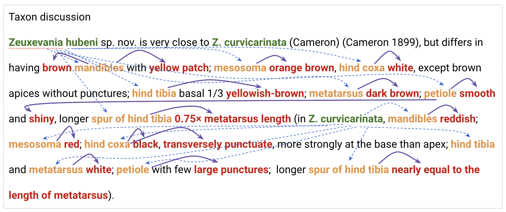

# BLAH 8
Project proposal for Biomedical Linked Annotation Hackathon 8

## Utilization of LLMs for the creation of synthetic concept and relation annotated articles for arthropod trait based literature mining.

### Background
Arthropods represent the most diverse group of animals on Earth. Their incredible adaptability has allowed them to inhabit diverse ecological niches. However, as biodiversity continues to decline, there is a growing need to understand the genomic and phenotypic adaptability of arthropods. One avenue to facilitate this understanding is through the extraction of pertinent trait information from the extensive literature available on the subject. We can extract arthropod-trait-value triples from scientific articles using Named Entity Recognition (NER) and Relation Extraction (RE). The development of effective NER and RE models is crucial to facilitate this understanding by automating the extraction of valuable trait information from relevant literature.

Image: Article paragraph with annotated entities and relations.

### Project Goals
1. Develop synthetic annotations created by Large Language Models (LLMs) for NER and RE tasks.
2. Enhance the identification of arthropod-related entities and their relationships within literature.

### Methodology
The proposed methodology includes the following steps:
- Annotation: Develop automated pipelines for generating synthetic annotations using LLMs.
- Named entity recognition: Build and compare new models based on LLMs that are specifically tailored for the extraction of arthropod, trait, and value entities.
- Relationship Extraction: Develop an RE models based on LLMs that can extract various relations, namely "hasTrait," "hasValue," and "hasContinuation" (between entities of the same type).
- Formatting: Create postprocessing methods to format the model output into PubAnnotation JSON.
- Validation: Use community-annotated articles to validate the performance of the developed models.

### Technology
The technology stack for this project includes:
- Named Entity Recognition (NER): This will combine existing tools like OGER and SpaCy, along with newly developed LLM-based models.
- Relation Extraction (RE): This will primarily utilize LLM-based models to extract relationships between identified entities.

### Outcome
The expected outcomes of this project are:
- Creation of synthetic annotations for NER and RE tasks, specifically tailored for arthropod trait data.
- Development of LLM-based annotation generation methods, with different prompts and methodologies.
- A comprehensive evaluation of the developed methods based on community annotations to ensure their validity and applicability.

### Timeline
1. Familiarization with Data Structure: This phase will involve a deep dive into the Artra DB's data structure to understand the nuances of arthropod-trait-value triples.
2. Development of LLM-based Annotation Methods: This phase will focus on developing different LLM-based annotation methods for NER and RE tasks.
3. Evaluation of Methods: The final phase will involve a rigorous evaluation of the developed methods based on community annotations and other relevant metrics to ensure their effectiveness.
